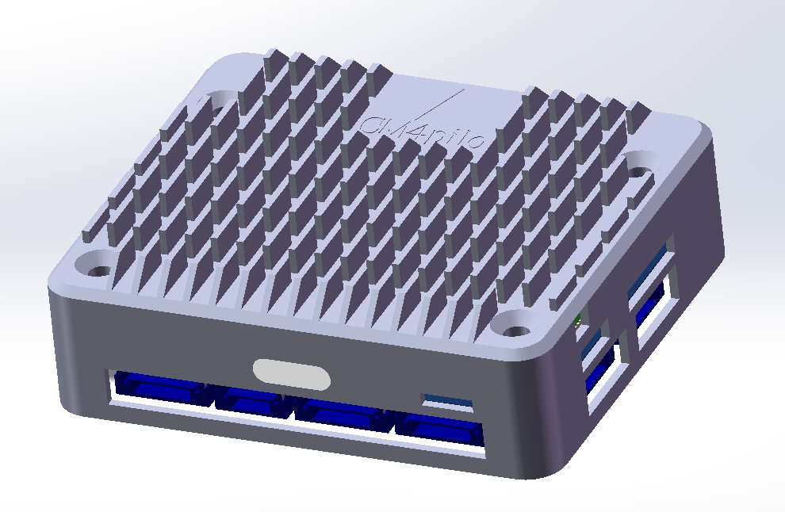
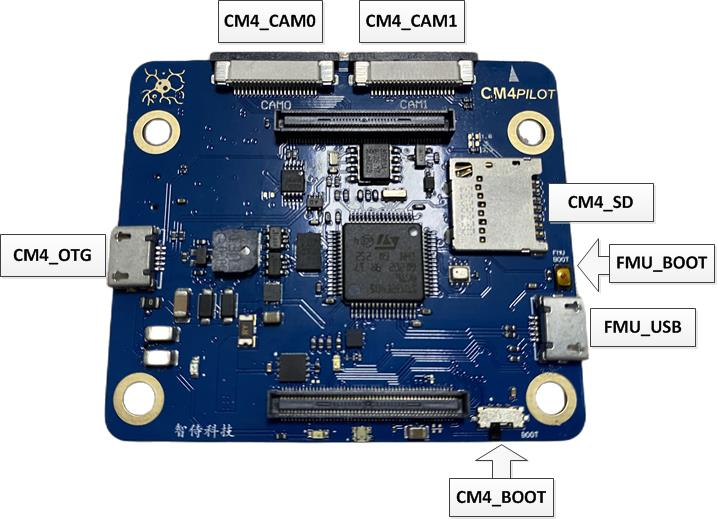
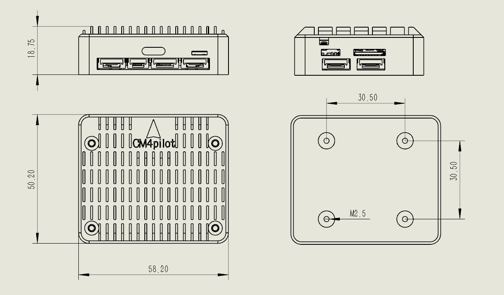

# CM4PILOT Integrated Flight Controller

The CM4PILOT is a low-cost and compact flight controller which integrated a Raspberry Pi CM4 in the cockpit.

## Features

 - Raspberry Pi CM4 + Ardupilot, Companion Computers in cockpit structure
 - Small Footprint and Lightweight, 58mm X 50mm X 18mm，26g(without shell)
 - Broadcom BCM2711, quad-core Cortex-A72 (ARM v8) 64-bit SoC @ 1.5GHz
 - STM32F405 microcontroller
 - IMU: BMI088
 - Mag: LIS3MDLTR
 - Baro: BMP280
 - RTC: PCF85063
 - 2 2-lane MIPI CSI camera ports
 - 2 microSD card slot port
 - 1 power ports(Analog)
 - 6 UARTs and USB ports for FMU
 - 2 UARTs and 4 USB2.0 and 1 OTG for CM4
 - 1 I2C port
 - 1 CAN port
 - 1 SBUS input and 8 PWM output (all support DShot)
 - External SPI port
 - Buzzer on board 
 - GRB LED on board
 - 128M flash on board

## UART Mapping

 - SERIAL0 -> USB(OTG1)
 - SERIAL1 -> USART1(Telem1)
 - SERIAL2 -> USART3 (CM4)
 - SERIAL3 -> UART4 (GPS)
 - SERIAL4 -> UART6 (GPS2)
 - SERIAL5 -> USART2 (SBUS)
 
## GPIOs

All 8 PWM channels can be used for GPIO functions.
The pin numbers for these PWM channels in ArduPilot are shown below:

| PWM Channels | Pin  | PWM Channels | Pin  |
| ------------ | ---- | ------------ | ---- |
| PWM1         | 50   | PWM8         | 57   |
| PWM2         | 51   | 
| PWM3         | 52   | 
| PWM4         | 53   | 
| PWM5         | 54   | 
| PWM6         | 55   | 
| PWM7         | 56   | 

## Analog inputs

The CM4PILOT flight controller has 3 analog inputs

 - ADC Pin11  -> Battery Current 
 - ADC Pin12  -> Battery Voltage 
 - ADC Pin10  -> RSSI voltage monitoring

