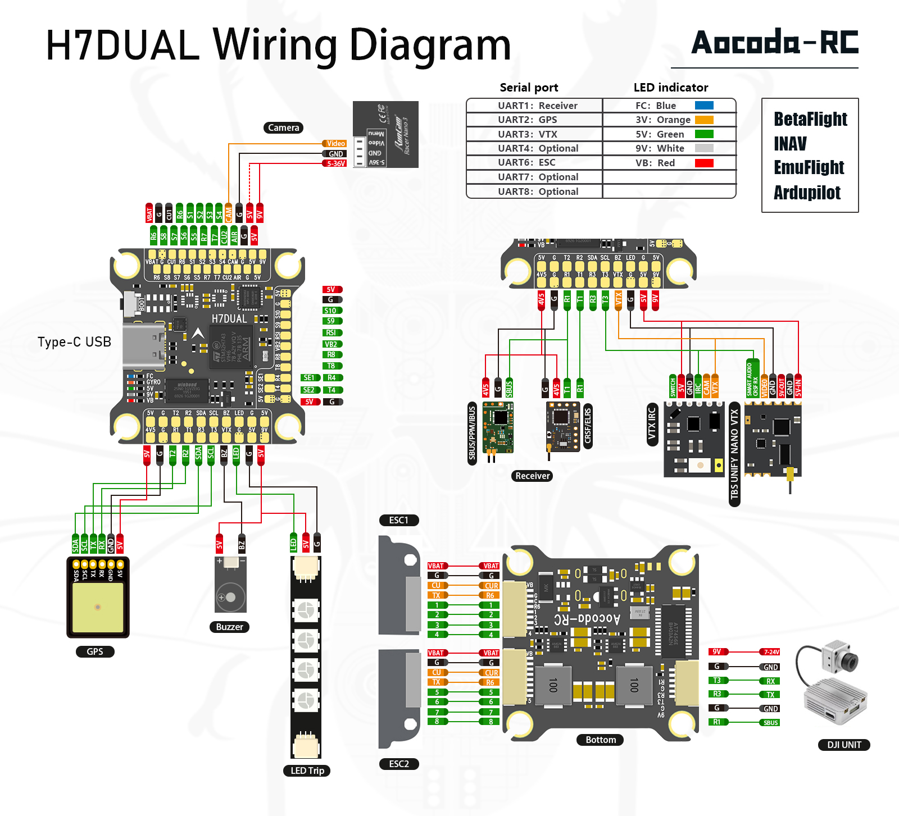

# Aocoda-RC-H743Dual Flight Controller

The Aocoda-RC-H743Dual is a flight controller produced by [Aocoda-RC](https://www.aocoda-rc.com/). 

## Features

- MCU：STM32H743VIH6
- Gyro：MPU6000/BIM270x2
- Baro：DPS310/MS56XX/BMP280
- Blackbox：128MB
- PWM output：10CH
- Servo：2CH
- UART：8CH
- Power Supply：3-6SLipo
- BEC Output：5V/2.5A, 9V/3A
- USB Connector: Type-C
- Weight：8.8g
- Size：37mm x 37mm
- Mounting Hole：30.5mm x 30.5mm

## Pinout

## UART Mapping

The UARTs are marked Rn and Tn in the above pinouts. The Rn pin is the receive pin for UARTn. The Tn pin is the transmit pin for UARTn.

 - SERIAL0 -> USB (primary mavlink, usually USB)
 - SERIAL1 -> UART1 (RC input)
 - SERIAL2 -> UART2 (GPS) 
 - SERIAL3 -> UART3 (VTX)
 - SERIAL4 -> UART4
 - SERIAL5 -> not available
 - SERIAL6 -> UART6 (ESC Telemetry)
 - SERIAL7 -> UART7
 - SERIAL8 -> UART8

## RC Input

RC input is configured on SERIAL1 (USART1), which is available on the Rx1, Tx1. PPM receivers are *not* supported as this input does not have a timer resource available. 

*Note* It is recommend to use CRSF/ELRS. 

With recommended option:

- Set SERIAL1_PROTOCOL<SERIAL1_PROTOCOL must be set to "23"
- Set SERIAL1_OPTIONS<SERIAL1_OPTIONS to "0".
  
## OSD Support

The Aocoda-RC-H743Dual supports OSD using OSD_TYPE 1 (MAX7456 driver).

## PWM Output

The Aocoda-RC-H743Dual supports up to 12 PWM outputs. 

- The pads for motor output S1 to S8 on the two motor connectors.
- S9, S10 for two servos
- SE1(S11), SE2(S12) for servo/pinio

The PWM is in 6 groups:

 - PWM 1, 2  in group1
 - PWM 3, 4  in group2
 - PWM 5, 6  in group3
 - PWM 7, 8  in group4
 - PWM 9, 10 in group5
 - PWM 11, 12 in group6

Channels within the same group need to use the same output rate. If any channel in a group uses DShot then all channels in the group need to use DShot.

## Pin IO

- PINIO1: 9V DCDC control (HIGH:on; LOW:off)

*Note: DCDC default is enabled.*

## Battery Monitoring

The board has a built-in voltage and current sensor. The current sensor can read up to 130 Amps. The voltage sensor can handle from 3S to 6S LiPo batteries.

The correct battery setting parameters are:

 - BATT_MONITOR 4
 - BATT_VOLT_PIN 10
 - BATT_CURR_PIN 11
 - BATT_VOLT_MULT 11

Please calibrate before use amp parameters.

 - BATT_AMP_PERVLT 17.0

*Note: Please check carefully before use BATT_AMP_PERVLT, as voltage divider circuit for data collection is at ESC/BEC side*

## Compass

The Aocoda-RC-H743Dual does not have a built-in compass, but you can attach an external compass using I2C on the SDA and SCL pads.

## Loading Firmware

Initial firmware load can be done with DFU by plugging in USB with the bootloader button pressed. Then you should load the "with_bl.hex" firmware, using your favourite DFU loading tool.

Once the initial firmware is loaded you can update the firmware using any ArduPilot ground station software. Updates should be done with the *.apj firmware files.

