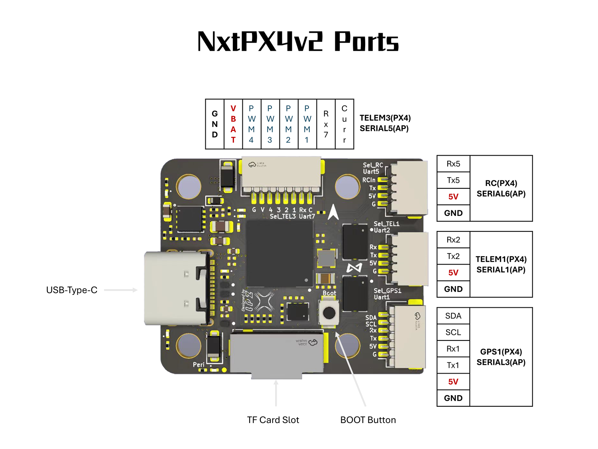
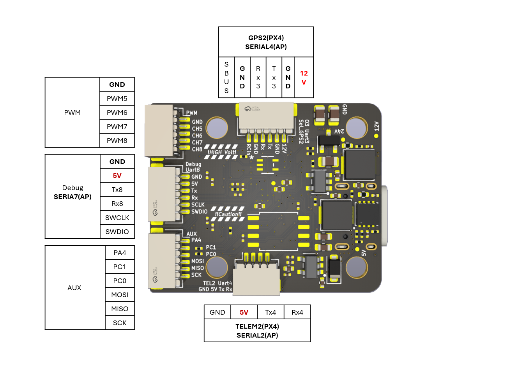

# NxtPX4v2 Flight Controller

The NxtPX4v2 is an open-source hardware designed and maintened by [HKUST UAV-Group](https://github.com/HKUST-Aerial-Robotics/Nxt-FC). And it is produced by [MicoAir Tech.](http://micoair.com/).

## Features

 - STM32H743 microcontroller
 - BMI088+BMI088(DUAL) IMU
 - SPL06 barometer
 - 12V 2.5A BEC; 5V 2.5A BEC
 - SDCard
- 7x UART
- 8x PWM
- 1x I2C
- 1x SPI
- 1x SWD

## UART Mapping

 - SERIAL0 -> USB
 - SERIAL1 -> UART2
 - SERIAL2 -> UART4
 - SERIAL3 -> UART1 (GPS)
 - SERIAL4 -> UART3 (VTX-HD)
 - SERIAL5 -> UART7 (ESC Telemetry)
 - SERIAL6 -> UART5 (RCIN)
 - SERIAL7 -> UART8

## RC Input

The default RC input is configured on the UART5_RX inverted from the SBUS pin. Other RC  protocols  should be applied at other UART port such as UART2, UART4 or UART8, and set the protocol to receive RC data: `SERIALn_PROTOCOL=23` and change SERIAL6 _Protocol to something other than '23'

## VTX Support

The SH1.0-6P connector supports a DJI O3 Air Unit connection. Pin 1 of the connector is 12v so be careful not to connect this to a peripheral requiring 5v.

## PWM Output

The NxtPX4v2 supports up to 8 PWM outputs. All channels support DShot.

PWM outputs are grouped and every group must use the same output protocol:

1, 2, 3, 4 are Group1;

5, 6 are Group 2;

7, 8 are Group 3;

## Battery Monitoring

The board has a internal voltage sensor and connections on the ESC connector for an external current sensor input.
The voltage sensor can handle up to 6S LiPo batteries.

The default battery parameters are:

 - BATT_MONITOR 4
 - BATT_VOLT_PIN 4
 - BATT_CURR_PIN 8
 - BATT_VOLT_MULT 10.2
 - BATT_CURR_SCALE 20.4

## Compass

The NxtPX4v2 does not have a built-in compass, but you can attach an external compass using I2C on the SDA and SCL connector.

## GPIOs

The remaining 3 outputs (labelled AUX1 to AUX3) are the "auxiliary" outputs. These are directly attached to the STM32H743.

The numbering of the GPIOs for PIN variables in ardupilot is:

 - AUX1 - PA4 - 81
 - AUX2 - PC1 - 82
 - AUX3 - PC0 - 83

## Physical

 - Mounting: 20 x 20mm, Φ3mm
- Dimensions: 27 x 32 x 8 mm
- Weight: 6.5g

## Ports Connector

## Loading Firmware

Initial firmware load can be done with DFU by plugging in USB with the bootloader button pressed. Then you should load the "with_bl.hex" firmware, using your favorite DFU loading tool.

Once the initial firmware is loaded you can update the firmware using any ArduPilot ground station software. Updates should be done with the "*.apj" firmware files.
